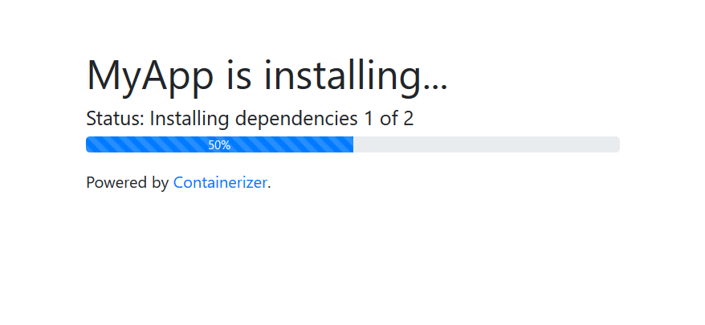

# Containerizer

[](https://npmjs.com/package/containerizer)
[](https://dependabot.com)
[](./LICENSE.md)
[](https://github.com/hrueger/containerizer/commits)
[](https://github.com/hrueger/containerizer/commits)

This is a simple and easy to use CLI to pack an application made with Angular and Express into a docker container.


## What does it do?
Containerizer will first search for a `package.json` and a `containerizer.json` file in the current directory. Those files are used to provide autocomplete. It will then ask you a series of questions, which are documented below. The answers will be saved in the `containerizer.json` file in the current working directory. It will then build a docker container on top of the [tarampampam/node:12.14-alpine](https://github.com/tarampampam/node-docker) image. It will also bundle a few NodeJS scripts and the configuration.

Once you start the container using either your own or the generated `docker-compose.yml` / `docker run` command, it will clone your GitHub repository and check out the required branch and commit. It will then install all the required dependencies, build your application and afterwards start it. During this installation process, a webserver is started on port 80, which serves a statuspage with information about the installation process. It looks like this:



If you change the environment variables, it will detect that and then rebuild the application.

## How to use
1. Install globally using `npm install containerizer --global`.
2. In the root folder of your Angular and Express App run `containerizer`.
3. Answer all the questions.
4. Enjoy your Docker Image!

## Update mechanism
Once your app is running, a http server on port `8314` will be avalible inside the container. By making a `GET` request to `http://localhost:8314` you will get a json string. When no updates are avalible, it will look like this:
```json
{
    "data":{
        "updatesAvalible": false,
        "containerizerVersion": "1.0.4",
        "time": 1582239681254
    }
}
```
Or, when updates are avalible, you will get something like this:
```json
{
    "data":{
        "updatesAvalible":true,
        "updateCount":1,
        "updates": [
            "The GitHub commit or release text"
        ],
        "containerizerVersion":"1.0.4",
        "time":1582239768649
    }
}
```
To start the update process, make a `GET` request to `http://localhost:8314/update`. When you get `{success: true}`, your app will be killed and the update progress started. After a few seconds, the status server will take over port `80` and provide status information.

## Roadmap
- :black_square_button: CLI Arguments
- :black_square_button: Update check script for releases mode
- :black_square_button: Updater for releases mode
- :white_check_mark: Update check script for commit mode
- :white_check_mark: Updater for commit mode
- :white_check_mark: Provide web server with status updates while installing (is implemented!)
- :white_check_mark: Fast update mode

Feel free to add more features with a pull request!

## Basic container environment options
| Name | Description | Default |
| ---- | ----------- | ------- |
| baseHref | The path where the application will later be accessible. | `/` |


## Config
| Question | Name in config file | Description | Default | Example |
| -------- | ------------------- | ----------- | ------- | ------- |
| Would you like to build the image with your last configuration loaded from `containerizer.json`? | n/a | Type `y` to skip all following questions and build using the `containerizer.json` file. | No (`n`) | n/a |
| Name of the image | `imageName` | The name of the generated docker image | current foldername | `MyCoolContainer` |
| Maintainer | `imageMaintainer` | The full name of the maintainer of the generated docker image | | `Max Mustermann` |
| Username of Maintainer | `imageMaintainerUsername` | The username of the maintainer of the generated docker image. This will be the scope for the image! | | `MMustermann` |
| Version | `imageVersion` | The version of the maintainer of the generated docker image. | `1.0.0` | `4.2.19` |
| Branch | `branch` | The branch of the git repository to be checked out | `master` | `my-cool-branch` |
| Commit (leave blank to use latest) | `commit` | The commit of the git repository to be checked out. Blank will be the latest commit. |  | `a94a8fe5ccb19ba61c4c0873d391e987982fbbd3` |
| Git repository URL | `repository` | The url of the git repository. | | `https://github.com/username/repository` |
| Source directory of Angular App | `ngSrcDir` | The source directory of your Angular App relative to the root of your repository. | | `app/frontend/src/` |
| Destination directory of Angular App | `ngDestDir` | The destination directory of your Angular App after it was built relative to the root of your repository. | | `app/dist/frontend` |
| Custom Angular build command (empty for default) | `customNgBuildCmd` | A custom build command to build the Angular App. |  | `ng build` |
| The file to start in order to run the application | `startFile` | The file to start to run the application. |  | `/app/dist/api/app.js` |
| Directories to run "npm install" (separate with spaces) | `npmInstallDirs` | Directories to run "npm install". Seperate them with spaces. In the config file this will be an array. |  | `app/frontend app/backend` |
| Enable fast update mode | `fastUpdateMode` | If enabled, updating will be faster but more diskspace will be used. Also `unnecessaryFilesAndDirs` will be ignored. | `y` | n/a |
| Support native dependencies | `supportNativeDependencies` | If enabled, `python`, `make` `g++` will be installed to make `node-gyp` work. Use it only when needed as it makes the image a lot bigger (additional 63 MB) | `n` | n/a |
| You can now edit the generated "containerizer.json" file to add filesToCreate, additionalBuilds and unnecessaryFilesAndDirs. Type in "Y" when you are done. | `filesToCreate`, `additionalBuilds`, `unnecessaryFilesAndDirs` | See below |  | See below |

### FilesToCreate
This property called `filesToCreate` is an array of objects. Those state, which files should be created before running the build. Those can be used for dynamic values from the environment.

#### Example:
```typescript
{
    ...
    "filesToCreate": [
        {
            "path": "app/src/environments/environment.ts", // this is the path relative to the repository root
            "template": "typescript", // template, see below
            "rootVariableName": "environment", // the variable name
            "properties": [ // those properties will be read from environment variables with the same name
                "apiUrl",
                "appUrl",
                "firebase_apiKey",
                "firebase_appId",
                "firebase_authDomain",
                "firebase_databaseURL",
                "firebase_messagingSenderId",
                "firebase_projectId",
                "firebase_storageBucket"
            ],
            "presetProperties": { // those properties will be preset
                "production": true
            }
        }
    ],
    ...
}
```

#### Templates:
| Template name | Preview |
| ------------- | ------- |
| `typescript` | <code lang="typescript">export const<br>    [rootVariableName] = {<br>    [property1]: [valueOfProperty1],<br>    [property2]: [valueOfProperty2],<br>    ...<br>};</code> |

Feel free to add more templates and create a pull request!


### AdditionalBuilds
This is an array of objects like this:
```json
{
    "dir": "/path/to/somewhere",
    "cmd": "npm run build"
}
```
`dir` points to the directory where `cmd` should be run.

### UnnecessaryFilesAndDirs
This is an array of files and/or folders which should be deleted after the successfull build to save disk space.


## License
MIT
